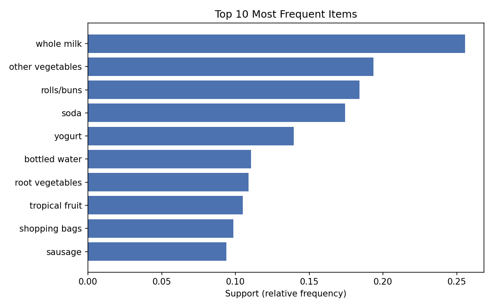
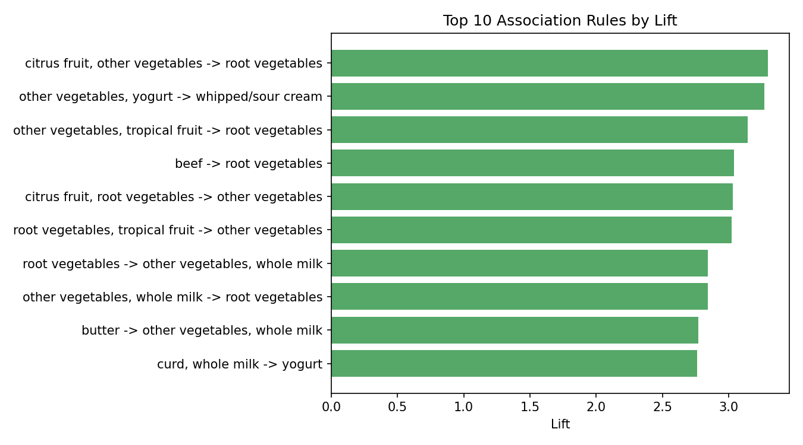
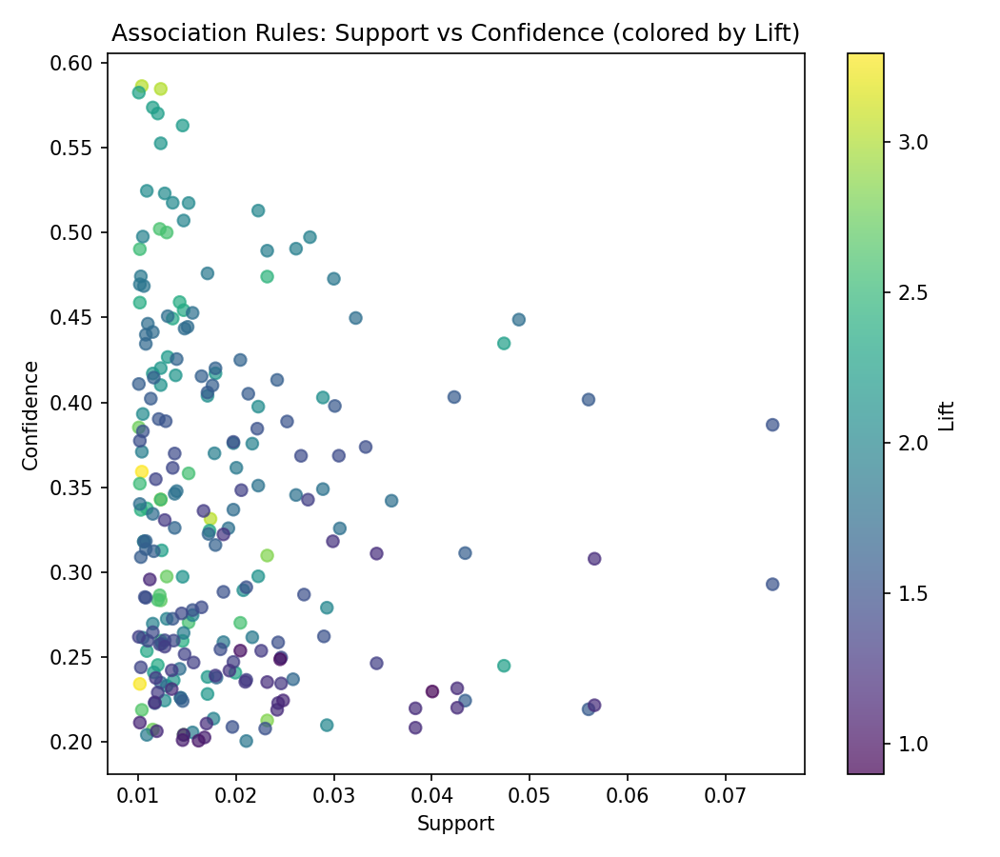

# Association Rule Learning on the Groceries Dataset

**Unsupervised Learning Methods — Assignment: Association Rule Learning**
Dataset: Groceries · Software: Python (pandas, mlxtend)

## Objective

This report applies association rule learning (the Apriori algorithm) to the Groceries transaction dataset to uncover which products customers tend to purchase together, and to interpret the resulting itemsets and rules.

## Question 1: Understand the Data

**a. Number of transactions:** the dataset contains **9,835 transactions** (one grocery basket per row).

**b. Number of distinct items:** there are **169 unique grocery items** across all transactions.

**c. The 10 most frequently purchased items** (count and support = fraction of transactions containing the item):

| Item | Count | Support |
|---|---|---|
| whole milk | 2513 | 0.2555 |
| other vegetables | 1903 | 0.1935 |
| rolls/buns | 1809 | 0.1839 |
| soda | 1715 | 0.1744 |
| yogurt | 1372 | 0.1395 |
| bottled water | 1087 | 0.1105 |
| root vegetables | 1072 | 0.1090 |
| tropical fruit | 1032 | 0.1049 |
| shopping bags | 969 | 0.0985 |
| sausage | 924 | 0.0940 |



Whole milk and other vegetables are by far the most commonly purchased items, each appearing in roughly a fifth to a quarter of all baskets — expected for grocery staples.

## Question 2: Frequent Itemsets

Using Apriori with a minimum support of **1% (0.01)**, **245 frequent itemsets of size ≥ 2** were found. The 10 with the highest support:

| Itemset | Support |
|---|---|
| other vegetables, whole milk | 0.0748 |
| rolls/buns, whole milk | 0.0566 |
| whole milk, yogurt | 0.0560 |
| root vegetables, whole milk | 0.0489 |
| other vegetables, root vegetables | 0.0474 |
| other vegetables, yogurt | 0.0434 |
| other vegetables, rolls/buns | 0.0426 |
| tropical fruit, whole milk | 0.0423 |
| soda, whole milk | 0.0401 |
| rolls/buns, soda | 0.0383 |

**c. Highest-support itemset:** `{other vegetables, whole milk}`, support = 0.0748 (≈7.5% of all transactions).

**d. Interpretation:** a support of 0.0748 means roughly 7–8 out of every 100 shopping trips include both other vegetables and whole milk. Because support is a population-wide frequency, high-support itemsets identify combinations that are common across the *whole* customer base, not just a niche of shoppers — good candidates for store-layout and promotion decisions that need to reach many customers at once.

## Question 3: Association Rules

Rules were generated from the frequent itemsets with a minimum confidence of **0.2**, producing **234 rules** in total. The 10 with the highest lift:

| Antecedent | Consequent | Support | Confidence | Lift |
|---|---|---|---|---|
| citrus fruit, other vegetables | root vegetables | 0.0104 | 0.3592 | 3.295 |
| other vegetables, yogurt | whipped/sour cream | 0.0102 | 0.2342 | 3.267 |
| other vegetables, tropical fruit | root vegetables | 0.0123 | 0.3428 | 3.145 |
| beef | root vegetables | 0.0174 | 0.3314 | 3.040 |
| citrus fruit, root vegetables | other vegetables | 0.0104 | 0.5862 | 3.030 |
| root vegetables, tropical fruit | other vegetables | 0.0123 | 0.5845 | 3.021 |
| other vegetables, whole milk | root vegetables | 0.0232 | 0.3098 | 2.842 |
| root vegetables | other vegetables, whole milk | 0.0232 | 0.2127 | 2.842 |
| butter | other vegetables, whole milk | 0.0115 | 0.2073 | 2.771 |
| curd, whole milk | yogurt | 0.0101 | 0.3852 | 2.761 |



For the full picture of all 234 rules, the chart below plots every rule's support against its confidence, colored by lift:



The rules cluster into two groups: a low-support/high-confidence/high-lift group (rare but strong fresh-produce combinations) and a high-support/lower-lift group (common staples like whole milk and soda, which co-occur often simply because they're each bought so frequently).

## Question 4: Understanding the Measures

### Rule 1: `{citrus fruit, root vegetables} → {other vegetables}`
- **Support (0.0104):** about 1% of all transactions contain citrus fruit, root vegetables, and other vegetables together.
- **Confidence (0.5862):** among customers who bought citrus fruit and root vegetables, 58.6% also bought other vegetables.
- **Lift (3.03):** these customers are about 3× more likely to also buy other vegetables than a random customer — a strong positive association.

### Rule 2: `{root vegetables} → {other vegetables, whole milk}`
- **Support (0.0232):** about 2.3% of all transactions contain root vegetables together with both other vegetables and whole milk.
- **Confidence (0.2127):** of customers who bought root vegetables, 21.3% also bought both other vegetables and whole milk.
- **Lift (2.842):** buying root vegetables makes a customer about 2.8× more likely to also buy this pair than average.

### Rule 3: `{whole milk} → {other vegetables}` (highest-support rule)
- **Support (0.0748):** about 7.5% of all transactions contain both whole milk and other vegetables.
- **Confidence (0.2929):** of customers who bought whole milk, 29.3% also bought other vegetables.
- **Lift (1.514):** a positive but comparatively weaker association than Rules 1 and 2, even though its support is far higher.

## Question 5: Find Interesting Rules

- **a. Highest confidence:** `{citrus fruit, root vegetables} → {other vegetables}`, confidence = 0.5862.
- **b. Highest lift:** `{citrus fruit, other vegetables} → {root vegetables}`, lift = 3.295.
- **c. Highest support:** `{whole milk} → {other vegetables}`, support = 0.0748.
- **d. Are these the same rule?** No. This is expected: support favors rules built from very common items regardless of association strength; confidence favors rules where the consequent is nearly guaranteed once the antecedent appears, even for rare combinations; lift favors rules where the antecedent and consequent co-occur far more than chance predicts, independent of frequency. A rule can be popular (high support) without being a strong or surprising association (low lift), and vice versa.

## Question 6: Interpret a Rule

**Selected rule:** `{citrus fruit, root vegetables} → {other vegetables}`

In simple language: customers who purchase citrus fruit and root vegetables also tend to purchase other vegetables. About 58.6% of baskets containing citrus fruit and root vegetables also contain other vegetables, and this combination is about 3× more likely than chance (lift = 3.03).

This is a **strong association**: confidence is well above both the 20% rule-generation threshold and the baseline purchase rate of other vegetables (≈19.3% of all transactions), and lift is comfortably above 1 — the co-occurrence isn't just because both items are individually popular. It likely reflects a genuine pattern (fresh-produce items bought together for the same meals) rather than coincidence.

## Question 7: Business Application

- **a. Products to place close together:** root vegetables and other vegetables (or citrus fruit and root vegetables) — both pairs show high confidence and high lift.
- **b. Possible product bundle:** a "fresh produce basket" combining citrus fruit, root vegetables, and other vegetables, since all three co-occur frequently and with high lift.
- **c. Recommendation example:** when a customer adds root vegetables and citrus fruit to their basket, the system could suggest other vegetables — an "customers who bought this also bought…" recommendation — since historical data shows a 58.6% chance the customer will want that item too.

## Question 8: Understanding Association

**a. Does an association rule prove causation?** No. Association rules describe correlation in purchasing behavior, not causation. A high-confidence, high-lift rule shows items are frequently bought together, not that one purchase *causes* the other — a third factor (e.g., a general tendency toward fresh, vegetable-based cooking) could explain all three appearing together.

**b. Why might a rule have high confidence but low lift?** Confidence only measures how often the consequent appears given the antecedent; lift compares that to how often the consequent appears overall. If the consequent (e.g., whole milk) is purchased in a huge fraction of all transactions regardless of context, almost any rule ending in "→ whole milk" will have high confidence simply because whole milk is everywhere — but lift stays near 1 because the antecedent didn't really change the odds versus baseline.

**c. What does lift > 1 indicate?** A positive association: the antecedent and consequent occur together more often than expected under independence. The further above 1, the stronger the association (lift = 1 means independence; lift < 1 indicates a negative association).

## Conclusion

Applying Apriori to the Groceries dataset (9,835 transactions, 169 items) surfaced clear, interpretable purchasing patterns. Fresh-produce items — other vegetables, root vegetables, citrus fruit, tropical fruit — form the strongest associations (lift ≈ 3), while rules involving very high-frequency staples like whole milk have high support but comparatively modest lift. These findings support concrete retail decisions: co-locating strongly associated fresh-produce items, building cross-category bundles, and powering "customers who bought this also bought…" recommendations.

## Reproducing the results

```bash
pip install pandas mlxtend matplotlib
python analysis.py
```

See [`analysis.py`](analysis.py) for the full code, and the [`results/`](results) folder for the complete (not just top-10) itemset and rule tables.
